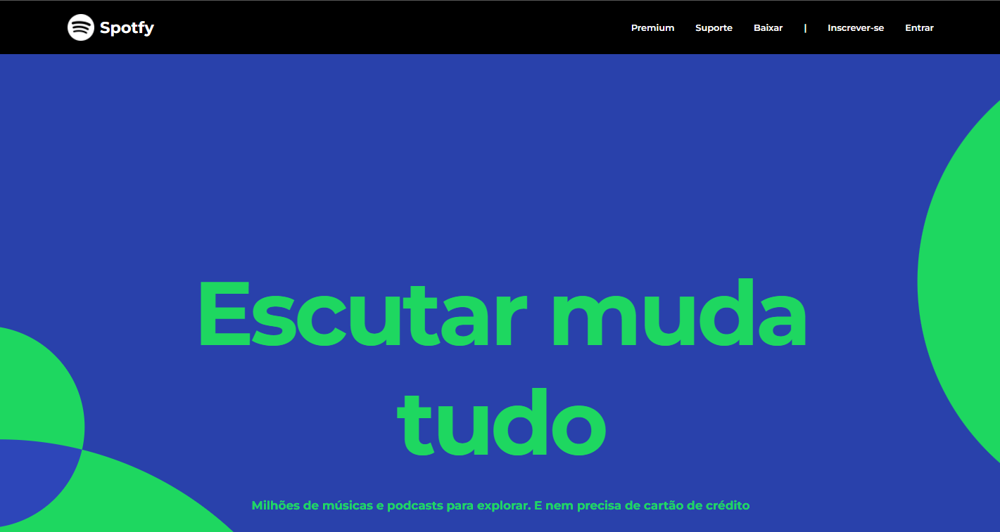

# Spotfy-Clone 

### Projeto desenvolvido durante a imersão React do XP40 - Gama Academy

Projeto desenvolvido com o intuito de práticar a construção de componentes do React com Typescript.
## 💻 Linguagens utilizadas
- Typescript
- React
